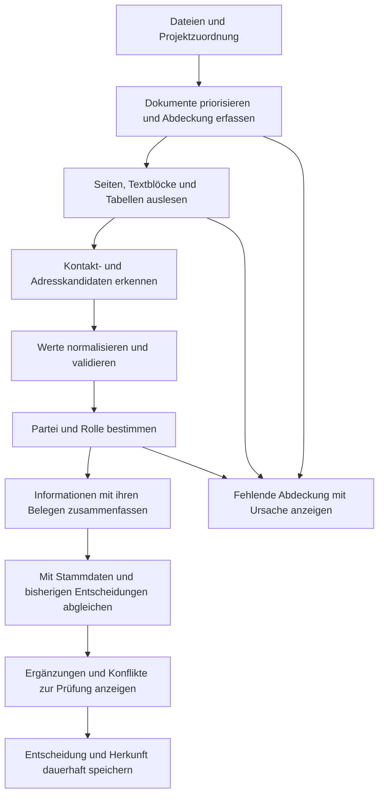

# Kundendatenerkennung: Analyse und vollständiger Umsetzungsplan

## Aktueller Umsetzungsstand – 9. September 2026

Die serverseitige Kernpipeline, additive Migration, gruppierte Kundenprüfung und
gezielte Neusuche sind implementiert. Seit dem ursprünglichen Entwurf wurden
Datumsfilter und Kontaktnamen verbessert, die serverweite Sperrliste und der
vollständige Erkennungsneuaufbau ergänzt sowie die Verwaltung in einen eigenen
Indexserver-Tab verschoben. Sperrlistenänderungen werden gesammelt bestätigt;
ein Batch veröffentlicht einmal die Kundenkomponente und startet keine OCR.
Eine ausstehende Veröffentlichung bleibt nach einem Neustart wiederholbar.

Inhaltsindex und Kundenerkennung verwenden dieselbe parallele Auslesung mit
Cache und begrenztem Workerbudget. Regulärer Metadatenabgleich, tägliche
Hashprüfung und ausdrücklich erzwungene Neuauslesung sind getrennte Abläufe.
Eine externe oder zusätzliche lokale Modellstufe ist nicht aktiviert.

Maßgeblich für den aktuellen Betrieb sind:

- [Bedienung und Grenzen der Kundenerkennung](kundendatenerkennung.md)
- [API und Batch-Verhalten](api.md)
- [Datenmodell und Migration](data-and-migrations.md)
- [Umsetzungsstand und offene Abnahmen](../Umsetzungsplanung.md)
- [Historische fachliche Prüfung](kundendatenerkennung-pruefbericht-2026-09-09.md)
- [Historische Prüfung der Dokumentverarbeitung](dokumentverarbeitung-pruefbericht-2026-09-09.md)

Unabhängige fachliche Abnahme, tatsächliche Laufzeit auf der Zielhardware und
native Plattformabnahme bleiben gesonderte Prüfaufgaben. Die Prozentziele und
Aufwandsschätzungen im ursprünglichen Plan sind keine gemessenen Ergebnisse und
keine verbleibende Aufwandszusage.

## Ursprünglicher Analyse- und Planungsstand

Der folgende Entwurf bleibt als historische Entscheidungsgrundlage erhalten.
Formulierungen wie „heute“, „geplant“ und „noch fehlend“ beziehen sich auf den
Zeitpunkt vor der Umsetzung, nicht auf den aktuellen Code. Bestandsbezogene
Abschnitte dürfen nicht in Assistenz- oder externe Modellkontexte übernommen
werden; für die Weiterentwicklung gelten synthetische Daten und Quellcode.

Stand: 9. September 2026. Grundlage: aktueller Arbeitsstand auf Commit `a29d366`, einschließlich der bereits vorhandenen lokalen Clientänderungen; lesende Analyse der lokalen Datenbanken und Recherche in Primärquellen. **Status: Planung, noch keine Änderung der Erkennungslogik oder Kundendaten.**

## 1. Ergebnis und Empfehlung

Die beobachteten Probleme sind nachvollziehbar. Die aktive Erkennung übernimmt einen Großteil der Zahlenfolgen aus Dokumenten als mögliche Telefonnummern, ohne die Dokumentrolle oder den Bezug zum Kunden zu prüfen. Gleichzeitig erzeugt sie aus Dokumenten ausschließlich Vorschläge für **Telefon und E-Mail**. Die übrigen Stammdaten werden dadurch nicht vervollständigt.

Im untersuchten lokalen Stand stehen **19.249 offene Vorschläge bei 81 Kunden**. Davon stammen **18.661, also 96,95 %, aus der aktiven Telefonregel**. 16 Kunden haben mindestens 300 offene Vorschläge, der höchste Wert beträgt 3.526. Einfaches Zusammenfassen gleicher Feldwerte würde lediglich 1.863 Vorschlagszeilen beziehungsweise 9,68 % entfernen. Die Hauptaufgabe ist deshalb, falsche Kandidaten und falsche Kundenzuordnungen zu verhindern; Zusammenfassen und eine bessere Oberfläche kommen hinzu.

Ich empfehle eine schrittweise überarbeitete Verarbeitung:

1. Qualität und Dokumentabdeckung sichtbar messen; bestehende Fehler reproduzierbar festhalten.
2. Telefon-/E-Mail-Erkennung validieren, Rollen berücksichtigen und Fundstellen zu Entscheidungen zusammenfassen.
3. Dokumente strukturiert und vollständig genug auslesen, einschließlich seitenweiser OCR und korrekter Office-Verarbeitung.
4. Anschriften, Firmen und Ansprechpartner als zusammengehörige Informationen erkennen.
5. Altvorschläge kontrolliert neu bewerten, Entscheidungen bewahren und die Prüfung im Client vereinfachen.
6. Ein zusätzliches Dokumentmodell oder Sprachmodell nur dann übernehmen, wenn es auf unseren Dokumenten einen gemessenen Mehrwert liefert.

Der angestrebte Nutzen: **wenige nachvollziehbare Entscheidungen, deutlich mehr tatsächlich auffindbare Kundendaten und eine konkrete Erklärung bei fehlenden Ergebnissen**. Eine Verbesserung der Qualität wird erst nach einem Vergleich mit fachlich geprüften Referenzdaten als erreicht bezeichnet.

## 2. Was heute automatisch erkannt wird

### 2.1 Ordner, Kunden und Projekte

| Information | Aktuelle automatische Ermittlung | Grenze / Folge |
|---|---|---|
| Projektwurzel | Schema `Leistungsart/Jahr/Kundenname, Ort`; erste drei Pfadbestandteile | Abweichende Ordnerstrukturen und Jahre vor dem Mindestjahr fallen heraus. Standard-Mindestjahr: 2016. |
| Anzeigename des Kunden | Text vor dem ersten Komma im Kundenordner | Keine semantische Prüfung, ob tatsächlich eine Person oder Firma gemeint ist. |
| Ort | Text nach dem ersten Komma | Wird bei Neuanlage als Kundenort verwendet; ein Projektort muss aber nicht der Wohn- oder Firmensitz sein. Bei bestehenden Kunden wird eine leere Stadt durch die reine Projektzuordnung nicht ergänzt. |
| Leistungsarten und Projekte | Über erkannte und zugeordnete Projektwurzeln | Hängen vollständig an der Ordnererkennung und Zuordnung. |
| Privatperson / Unternehmen | Wenn irgendein Namenstoken in der Vornamenliste vorkommt: Privatperson; sonst Unternehmen | Beispielsweise wird synthetisch `Max Mustermann GmbH` als Privatperson eingeordnet. |
| Zuordnung zu bestehenden Kunden | Bestehender Projektbesitzer oder exakt normalisierter Name; ähnliche Namen über `SequenceMatcher` ab 0,86 | Ähnliche Namen, unterschiedliche Orte oder widersprüchliche Besitzer erzeugen Prüffälle. Automatisches unscharfes Zusammenführen erfolgt bereits nicht. |

Die Normalisierung verwendet Unicode-Normalisierung, Kleinschreibung und vereinheitlichte Trennzeichen. Sie ist keine belastbare Identitätsprüfung. Die Erkennung lädt zudem nur die ersten 2.000 Kunden; bei den aktuell 81 Kunden ist das **keine Ursache**, aber eine spätere Skalierungsgrenze.

Belege: [Ordnerklassifikation](../packages/server/src/papagui_server/domain/folder_structure.py), Funktionen `classify` ab Zeile 49 und `normalize_identity` ab Zeile 13; [Identitätsregeln](../packages/server/src/papagui_server/domain/customer_recognition.py), `CustomerIdentityPolicy` ab Zeile 25; [Orchestrierung](../packages/server/src/papagui_server/application/recognition.py), `synchronize`, `_process_group` und `_assign`.

### 2.2 Dokumentvorschläge

| Feld / Typ | Aktiver Erzeuger vorhanden? | Aktuelles Verhalten |
|---|---|---|
| E-Mail | Ja | Regex über den gesamten Dokumenttext; jeder Treffer erhält fest 0,90. |
| Telefon | Ja | Sehr breite Zahlenregex; jeder Treffer erhält fest 0,75. Kein Vorwahl-, Kontext- oder Rollenabgleich. |
| Firma | Nein | Speicherung, manuelle Bearbeitung und ältere Vorschläge sind möglich; die aktive Dokumenterkennung erzeugt dieses Feld nicht. |
| Straße / Hausnummer | Nein | Keine aktive Dokumentregel. |
| Postleitzahl | Nein | Keine aktive Dokumentregel. |
| Kundenort aus Dokumenten | Nein | Keine aktive Dokumentregel; Ordnerort ist ein separater Mechanismus. |
| Ansprechpartner mit Name, Rolle, E-Mail, Telefon | Nein | Datenmodell und Annahme migrierter Kontaktvorschläge existieren; ein aktiver Kontakt-Erzeuger fehlt. |
| Unternehmenstyp aus Dokumenten | Nein | Nur die einfache Ordnernamen-Heuristik ist aktiv. |
| Notizen, Tags, Journal | Nein | Werden durch diese Erkennung nicht aus Dokumenten erzeugt. Das ist auch kein notwendiges Ziel dieser Verbesserung. |

Dokumentvorschläge werden nur erzeugt, wenn das betreffende Stammdatenfeld leer ist. Bereits eingetragene Werte blockieren neue Kandidaten für dieses Feld vollständig. Bestehende Vorschläge verschwinden aber nicht automatisch, wenn das Feld später ausgefüllt wird.

Der Prozentwert beschreibt derzeit **keine gemessene Wahrscheinlichkeit, dass die Information zum Kunden gehört**. Er ist eine feste Zahl pro Regex. Ein Rechnungsdatum kann deshalb als „Telefon, 75 %“ erscheinen.

Belege: [Dokumentregeln](../packages/server/src/papagui_server/domain/customer_recognition.py), `document_candidates` ab Zeile 39; [Vorschlagserzeugung](../packages/server/src/papagui_server/application/recognition.py), `_document_suggestions` ab Zeile 367; [Speicherung und Annahme](../packages/server/src/papagui_server/adapters/customer_suggestions.py); [Altdatenmigration](../packages/server/src/papagui_server/adapters/customer_schema.py), `_migrate_legacy_suggestions`.

### 2.3 Welche Dokumente tatsächlich ankommen

Die Verarbeitung läuft serverseitig: Dateien erfassen → Text extrahieren → Katalog aufbauen → Kunden/Projekte erkennen → Vorschläge erzeugen → Generation veröffentlichen. Automatische Läufe und täglicher Vollabgleich sind standardmäßig aktiviert; das normale Intervall beträgt 24 Stunden. „Erkennung jetzt starten“ bewertet lediglich den vorhandenen Katalog neu und führt keine neue OCR aus.

| Format / Stufe | Aktueller Stand | Wesentliche Lücke |
|---|---|---|
| PDF mit Text | `pdftotext -layout` | Text wird als ein String gespeichert; keine nutzbaren Seiten-/Blockkoordinaten für Rollen und Fundstellen. |
| PDF mit Scan | Tesseract Deutsch, standardmäßig 200 DPI, erste 5 Seiten; bei bestimmten Dateinamen 25 | OCR nur, wenn der gesamte native Text unter 500 Zeichen bleibt. Gescanntes Adressblatt in einem sonst textreichen PDF wird übersehen. |
| DOC | `antiword` | Werkzeugfehler ergeben still leeren Text. |
| DOCX | Nur `word/document.xml`, einzelne XML-Texte durch Zeilenumbrüche verbunden | Kopf-/Fußzeilen fehlen; formatierte Wörter können zerrissen werden; Tabellen- und Absatzbeziehungen fehlen. |
| XLS | Aufruf von `catdoc` | Unpassender Leser für Excel; durch korrekten XLS-Parser ersetzen. |
| XLSX | SharedStrings und Worksheet-XML als rohe Textknoten | Zellindizes und Zahlen werden zu Text; Zellen, Überschriften und Werte sind nicht zuverlässig verbunden. |
| TXT, CSV, MD, LOG, JSON, XML, YAML/YML, INI | UTF-8-Text, Ersetzungszeichen bei anderen Encodings | CSV/strukturierte Inhalte werden nicht fachlich interpretiert; Zahlenlastige Dateien erhöhen das Rauschen. |
| JPG, PNG, TIFF; EML/MSG; ODT | Keine aktive Inhaltsauslesung | Dateivorkommen bedeutet nicht, dass Kundendaten daraus erkannt werden. |
| Dateigröße / Textmenge | Standard: höchstens 100 MB pro Datei, höchstens 2 Mio. zurückgegebene Zeichen | Auslassungen werden nicht als verständliche Abdeckungsdiagnose dargestellt. |
| Auswahl für Kundenerkennung | Standardmäßig 24 neueste Dokumente **mit Text je Projekt**, sortiert nach Dateiänderungsdatum | „Bevorzugte Dokumentmuster“ erhöhen nur OCR-Seitenlimits; sie priorisieren nicht diese Auswahl. |

Poppler, Tesseract mit Deutsch, antiword und catdoc sind im vorgesehenen Server-Dockerimage enthalten. „OCR fehlt grundsätzlich“ wäre deshalb eine falsche Diagnose. Laufzeitverfügbarkeit, erfolgreiche Ausführung und die tatsächlich gelesenen Seiten sind allerdings nicht getrennt dokumentiert.

Inkrementelle Läufe überspringen Dateien bei unverändertem Änderungszeitpunkt und unveränderter Größe. Verbesserte Parser, geänderte OCR-Einstellungen oder vorherige Extraktionsfehler lösen dabei keine gezielte Wiederholung aus. Ein Vollaufbau kann diese Cache-Lücke umgehen, ist aber als dauerhafte Lösung unnötig teuer.

Belege: [Extraktion](../packages/server/src/papagui_server/adapters/catalog_extraction.py), `extract`, `_pdf`, `_office_xml`; [Indexaufbau](../packages/server/src/papagui_server/adapters/catalog.py), insbesondere Zeilen 117–151; [Dokumentauswahl](../packages/server/src/papagui_server/adapters/catalog_reader.py), `document_evidence` ab Zeile 218; [Defaults](../packages/server/src/papagui_server/domain/models.py); [Serverimage](../deploy/server/Dockerfile); [Laufreihenfolge](../packages/server/src/papagui_server/application/indexing.py), `_execute_run`.

## 3. Befunde aus den lokalen Daten und reproduzierten Beispielen

### 3.1 Mengen und Verteilung

Die Kundenzahlen wurden in `docker-server-data/customers.db` lesend ermittelt und mit dem aktiven lokalen Clientbestand abgeglichen. Maßgebliche Kundengeneration: `20260909T164940.452640Z-763e3ffb`; Indexgeneration: `20260909T164938.371077Z-d05a271c`, gebaut am 9. September 2026 um 16:49:13 UTC. Während der Analyse aktualisierte die bereits laufende Anwendung den Clientbestand; die hier berichteten Kunden- und Vorschlagszahlen blieben dabei gleich. Einträge aus mehreren Sicherungen wurden **nicht addiert**. Es wurden keine persönlichen Kundendaten ins Internet übertragen. Beispiele im Bericht verwenden ausschließlich pseudonymisierte Kennungen oder erfundene Werte.

Die [maschinenlesbare Auswertung mit Methodik](kundendatenerkennung-audit-2026-09-09.json) enthält die aggregierten Ergebnisse. Alle Datenbankzugriffe erfolgten mit SQLite-URI `mode=ro` und lesenden Abfragen. Die ältere `data/customers.db` mit 343 Vorschlägen und die Legacy-Statusdatenbanken sind vom aktuellen Katalog getrennt; ihre Zahlen werden hier nicht als aktuelle Erkennungsleistung verwendet.

| Messwert | Ergebnis |
|---|---:|
| Kunden / zugeordnete Projekte | 81 / 83 |
| Vorschläge insgesamt | 19.252 |
| Offene Vorschläge | 19.249 |
| Angenommene / abgelehnte Vorschläge | 1 / 2 |
| Offene Vorschläge aus `phone-pattern` | 18.661 |
| Offene Vorschläge aus `email-pattern` | 379 |
| Offene Vorschläge aus älteren Regeln | 209 |
| Kunden mit mindestens 300 offenen Vorschlägen | 16 |
| Maximum / Median offener Vorschläge je Kunde | 3.526 / 54 |
| Kunden, bei denen von Firma, E-Mail, Telefon, Straße, PLZ und Ort nur Firma gefüllt ist und keine Kontakte vorliegen | 55 |
| Davon mit mindestens 300 offenen Vorschlägen | 8 |
| Davon ohne Vorschläge | 3 |
| Durch bloße Gleichheit von Kunde, Feld und kleingeschriebenem getrimmtem Wert entfernbare Mehrfachzeilen | 1.863 / 9,68 % |

„Leer“ bedeutet hier **fehlende Kontakt- und Adressdaten**. Alle 81 Kunden haben einen Firmenwert; im streng wörtlichen Sinn sind daher nicht sämtliche Felder leer. Ein Firmenwert allein ist keine Aussage über seine fachliche Richtigkeit.

Beispiel `K-4fc82b26`: nur Firma gefüllt, keine Kontakte, dennoch 1.832 offene Vorschläge, davon 1.785 Telefon und 47 E-Mail. Beim Kunden mit der höchsten Vorschlagszahl kommen 3.516 Telefonvorschläge aus lediglich 19 Quellen; 3.490 unterschiedliche rohe Telefonwerte zeigen, dass Duplikate allein die Masse nicht erklären.

Diese Mengen sind **keine gemessene Fehlerquote**. Wie viele Werte wirklich dem jeweiligen Kunden gehören, muss anhand eines fachlich geprüften Referenzbestands bewertet werden.

Weitere Diagnose der 18.661 Telefonvorschläge: 7.964 enthalten Zeilenumbrüche, 729 entsprechen syntaktisch Datumsangaben und 17.076 haben im gespeicherten Ausschnitt kein erkennbares Telefon-/Mobil-/Fax-Label. Die Kategorien überschneiden sich; fehlende Labels allein beweisen keinen Fehler. Ein einzelnes PDF mit 614.527 extrahierten Zeichen verursacht 3.067 Telefonvorschläge.

Eine zusätzliche rein lokale Prüfung mit dem bereits installierten `phonenumbers` 9.0.34 und Parsing-Voreinstellung DE stuft 6.135 Werte als nummernplankonform ein. Das ist **keine Präzisionsmessung**: Auch diese Werte können Tabellenzahlen oder fremde Telefonnummern sein. Die konkrete Messung zeigt, warum Bibliotheksvalidierung und Rollenprüfung zusammengehören.

### 3.2 Dokumentabdeckung und die drei Nullfälle

Der aktuelle Katalog enthält 8.063 Dateien. 2.767 gelten nach den bisherigen Regeln als inhaltlich geeignet, 2.177 haben Volltext. Davon liegen 948 Texte innerhalb erkannter Projekte und 1.229 außerhalb. Eine fehlende Projektwurzel ist nicht automatisch ein Fehler: ältere oder bewusst ausgeschlossene Bestände müssen gesondert eingeordnet werden.

| Format | Dateien | Dateien mit Volltext im aktuellen Katalog |
|---|---:|---:|
| PDF | 1.572 | 1.570 |
| DOC | 388 | 388 |
| DOCX | 117 | 117 |
| XLSX | 39 | 39 |
| **XLS** | **588** | **0** |
| JPG / JPEG | 3.891 / 742 | 0 / 0 |
| PNG / TIF | 8 / 1 | 0 / 0 |
| EML | 6 | 0 |
| RTF | 8 | 0 |

Volltext bedeutet hier lediglich „nichtleerer Text“, nicht vollständige oder korrekte Extraktion. Die 588 XLS-Dateien sind eine konkret belegte Ausleselücke. Die vielen Bilder können überwiegend Projektfotos sein; ihre Anzahl darf nicht mit der Anzahl übersehener Kontaktblätter gleichgesetzt werden.

Eine Simulation mit dem Standardlimit 24 und der tatsächlichen Sortierung berücksichtigt 802 der 948 Projekttexte und lässt 146 aus; 13 Projekte überschreiten das Limit. **Das ist eine Simulation des Defaults, keine Behauptung über eigens ausgelesene Laufzeiteinstellungen.** Alle Quellen der aktuellen offenen Regex-Vorschläge liegen in dieser Auswahl. Ob die 146 ausgelassenen Texte zusätzliche Kundendaten enthalten, wurde nicht vollständig annotiert.

| Nahezu leerer Kunde | Belegter Zustand | Was daraus folgt |
|---|---|---|
| `K-7902699b` | Ein DOCX mit 567 Zeichen; keine Treffer der aktuellen Telefon-/E-Mail-Funktion | Es ist bisher nicht belegt, dass überhaupt geeignete Kontakt- oder Adressdaten enthalten sind. Ein Nullergebnis kann richtig sein. |
| `K-624b60c5` | 30 JPG und eine JBF-Datei; keine Datei mit ausgelesenem Inhalt | Bild-/Scanabdeckung fehlt. Erst eine Bildsichtung beziehungsweise Texterkennung kann zeigen, ob verwertbare Angaben vorhanden sind. |
| `K-7f2253d7` | Ein DOCX und ein PDF mit 6.736 beziehungsweise 7.148 Zeichen; keine Telefon-/E-Mail-Treffer; beide mit einem syntaktischen PLZ-Ort-Signal | Die fehlende Adresserkennung ist hier ein konkreter Ansatzpunkt. Das Signal allein bestätigt noch keine Kundenanschrift. |

Diese Fälle begründen drei verschiedene Produktzustände: „keine belegbaren Angaben“, „Dokumente noch nicht ausgelesen“ und „andere Feldarten müssen geprüft werden“. Sie dürfen nicht als ein einheitliches „0 Vorschläge“ zusammenfallen.

### 3.3 Nachgewiesene Fehler der Regeln

Die folgenden Eingaben wurden synthetisch mit der tatsächlichen Funktion `document_candidates` geprüft:

| Erfundener Dokumentinhalt | Tatsächliche Ausgabe | Erwartung |
|---|---|---|
| `Rechnungsnummer: 20260001234` | Telefonvorschlag mit 75 % | Keine Telefonnummer. |
| `Datum: 09.09.2026` | Telefonvorschlag mit 75 % | Datum erkennen beziehungsweise ausschließen. |
| `001`, `002`, `003`, `004`, `005` in aufeinanderfolgenden Zeilen | Eine zusammenhängende Telefonnummer mit 75 % | Tabellenzahlen nicht über Zeilengrenzen verkleben. |
| `Musterstraße 12` und nächste Zeile `12345 Musterstadt` | Telefonwert aus Hausnummer und PLZ | Zusammenhängende Anschrift erkennen. |
| IBAN-Beispiel `DE89 3704 0044 0532 0130 00` | Zahlenausschnitt als Telefon | Bankverbindung als Negativkontext erkennen. |
| E-Mail eines Lieferanten im Briefkopf | Kunden-E-Mail-Kandidat mit 90 % | Lieferant als eigene Partei erkennen. |
| Dieselbe Telefonnummer in nationaler, internationaler und Schrägstrich-Schreibweise | Drei getrennte Kandidaten | Einen normalisierten Wert mit mehreren Belegen bilden. |

Zusätzlich wurde die echte Vorschlagsorchestrierung mit einer In-Memory-Testumgebung geprüft: 24 Dokumente mit jeweils einer gleichen Lieferantenmail und 13 Rechnungsnummern erzeugen **336 Vorschläge bei nur 14 unterschiedlichen Rohwerten**. Ein identischer weiterer Lauf erzeugt keine neuen Zeilen. Das Umbenennen eines Dokuments erzeugt jedoch 14 weitere Vorschläge. Werden die beiden Stammdatenfelder anschließend gefüllt, entstehen keine neuen Vorschläge, aber die vorhandenen 350 bleiben erhalten.

Die Ursache: Der Fingerprint enthält neben Kunde, Feld und Wert auch den Dokumentpfad. Er erkennt den wiederholten Import derselben Fundstelle, aber nicht dieselbe fachliche Information in verschiedenen Dokumenten.

### 3.4 Zusätzliche Probleme im Client

- Der Zähler zeigt die Anzahl offener Rohzeilen, nicht die Anzahl verschiedener Entscheidungen. Für jede Zeile wird eine Karte erzeugt; Pagination und Gruppierung fehlen.
- Ein Ladefehler setzt Liste und Zähler auf null. Nur der Tooltip unterscheidet den Fehler von „keine Vorschläge“.
- Der offene Vorschlagsdialog hält Liste und Kundenrevision vom Öffnungszeitpunkt fest. Nach einer Entscheidung wird die dahinterliegende Detailansicht neu geladen, der Dialog aktualisiert seine Karten und Revision jedoch nicht. Daraus folgt ein möglicher Revisionskonflikt bei der zweiten Annahme. Dieser Ablauf ist aus dem Code abgeleitet, nicht als vollständiger Live-Klicktest reproduziert.
- Die Quellen stehen als Text in den Karten; das gezielte Öffnen der Fundstelle fehlt.

Belege: [Vorschlagsdialog und Zustände](../packages/client/src/papagui_client/gui/customer_detail.py), `_CustomerSuggestionsDialog`, `set_suggestions`, `set_suggestions_error`; [Entscheidungsablauf](../packages/client/src/papagui_client/gui/main.py), `decide_customer_suggestion`. Die schon vorhandenen lokalen Verbesserungen der asynchronen Kundenanzeige werden bei einer Umsetzung berücksichtigt.

## 4. Recherche: geeignete Verfahren und konkrete Auswahl

Die Recherche wurde am 9. September 2026 anhand der unten verlinkten offiziellen Dokumentationen und Projektquellen durchgeführt. Die Werkzeugfähigkeiten stammen aus diesen Quellen; die Auswahl und die vorgeschlagene Architektur sind meine Schlussfolgerung für PapaGUI. Es wurde kein fremder Benchmark als zugesicherte Qualität auf unseren Dokumenten übernommen.

| Baustein | Rechercheergebnis | Entscheidung für PapaGUI |
|---|---|---|
| Telefonnummern | Googles libphonenumber unterscheidet mögliche und gültige Nummernbereiche; der Python-Port unterstützt Parsing, Suche und Formatierung. Eine gültige Nummer belegt weder Erreichbarkeit noch Besitzer. [FAQ](https://github.com/google/libphonenumber/blob/master/FAQ.md), [Python-Port](https://github.com/daviddrysdale/python-phonenumbers) | `phonenumbers` als Validator und Normalisierer einsetzen, zusätzlich Kontext und Partei prüfen. Länderannahme DE nur für unpräfixierte Nummern; internationale Präfixe respektieren. |
| E-Mail | `email-validator` liefert syntaktische Prüfung und normalisierte Werte; DNS-Prüfung kann abgeschaltet werden. [Projektquelle](https://github.com/JoshData/python-email-validator) | Lokal mit `check_deliverability=False` prüfen. Keine Besitzerverifikation behaupten; Rollenprüfung bleibt separat. |
| Textpositionen im PDF | `pdfplumber` kann Wörter mit Koordinaten und Tabelleninformationen liefern. [Dokumentation](https://github.com/jsvine/pdfplumber) | Für die erste strukturierte PDF-Verarbeitung verwenden; vorhandene Poppler-Auslesung bleibt als Fallback möglich. Laufzeit und Genauigkeit im Referenzbestand messen. |
| OCR | Tesseract bietet TSV/hOCR mit Wortpositionen und Konfidenzen. Die Qualitätsdokumentation behandelt Auflösung, Schräglage und Segmentierung. [Ausgabeformate](https://tesseract-ocr.github.io/tessdoc/Command-Line-Usage.html), [Qualität](https://tesseract-ocr.github.io/tessdoc/ImproveQuality.html) | Vorhandenes Tesseract weiterverwenden; bedürftige Seiten einzeln lesen, 300 DPI für schwierige Seiten erproben, Rotation/Schräglage behandeln, Ergebnisse strukturiert speichern. |
| Word | `python-docx` stellt abschnittsbezogene Kopf- und Fußzeilen bereit. [Dokumentation](https://python-docx.readthedocs.io/en/latest/user/hdrftr.html) | Absätze/Runs, Tabellen, Kopf-/Fußzeilen zusammenhängend lesen. Textboxen und eingebettete Objekte als gesonderte Abdeckungsfälle testen; keine vollständige Layouttreue voraussetzen. |
| Excel | `openpyxl` bietet einen speichersparenden Lesemodus; `xlrd` liest das alte XLS-Format. [openpyxl](https://openpyxl.readthedocs.io/en/stable/optimized.html), [xlrd](https://xlrd.readthedocs.io/en/latest/) | Echte Zellwerte, Zeilen, Spalten und Blattnamen auslesen. Führende Nullen und Zahlenformat beachten. Formeln nicht ausführen; vorhandene Ergebniswerte beziehungsweise fehlende Ergebnisse kennzeichnen. |
| Kontext und Rollen | Presidio zeigt, wie Kontextwörter schwache Muster verbessern; spaCy verbindet Tokenregeln mit statistischen Komponenten. [Presidio-Beispiel](https://github.com/data-privacy-stack/presidio/blob/main/docs/tutorial/06_context.md), [spaCy-Regeln](https://spacy.io/usage/rule-based-matching) | Das Prinzip gezielt übernehmen: Kontaktlabel, Partei, Dokumenttyp und Blockbeziehungen prüfen. Ein Name- oder E-Mail-Detektor allein löst die Kundenzuordnung nicht. Presidio wird dafür nicht als zusätzliche Pflichtplattform eingeführt. |
| Schwierige Layouts | Docling unterstützt Layout, Lesereihenfolge, Tabellen, OCR und lokale Verarbeitung mit strukturiertem Dokumentmodell. [Projektbeschreibung](https://docling-project.github.io/docling/), [Dokumentmodell](https://docling-project.github.io/docling/concepts/docling_document/) | Als begrenzten Vergleichskandidaten für schwierige Dokumente testen. Übernahme nur bei besserer Qualität innerhalb des gemessenen Serverbudgets. |
| Qualitätsbewertung | Precision und Recall messen unterschiedliche Fehler; angezeigte Wahrscheinlichkeiten benötigen Kalibrierung mit getrennten Daten. [Metriken](https://scikit-learn.org/stable/modules/model_evaluation.html#precision-recall-f-measure-metrics), [Kalibrierung](https://scikit-learn.org/stable/modules/calibration.html) | Kandidatenqualität und Wiederfindung getrennt messen. Anfangs begründete Qualitätsstufen anzeigen; Prozentwahrscheinlichkeiten erst nach überprüfter Kalibrierung. |

Ein umfassender Wechsel auf ein Sprachmodell ist für die erste Verbesserung nicht erforderlich. Er würde Fehler durch falsche Dokumentauswahl, beschädigte Tabellen und doppelte Vorschlagsverwaltung nicht automatisch beheben. Eine spätere Modellstufe soll konkrete verbleibende Zweifelsfälle bearbeiten, mit nachvollziehbarer Fundstelle und denselben Prüfregeln wie die übrige Verarbeitung.

## 5. Zielablauf und fachliche Regeln

### 5.1 Geeignete Dokumente finden

Alle unterstützten Dokumente erhalten eine kostengünstige Erstbewertung. Anschreiben, Aufträge, Angebote, Verträge und bekannte Kontaktlisten werden anhand von Dateiname **und Inhalt** priorisiert. Ein Dateiname allein ist kein Wahrheitsbeleg. Allgemeine Leistungsbeschreibungen, technische Berechnungen, Normen und Zahlenlisten erhalten geringere Priorität für Stammdaten.

Die Auswahl verteilt sich über Projekte und Dokumentarten eines Kunden. Sie berücksichtigt Textqualität und bereits fehlende Felder. Dateiänderungsdatum ist höchstens ein Hilfsmerkmal; Kopieren einer alten Datei macht ihre Kontaktdaten nicht aktuell.

Ein schneller Durchlauf bearbeitet die aussichtsreichsten Dokumente. Falls belegbare Felder weiter fehlen, folgt eine begrenzte vertiefte Suche. Budgetgrenzen werden als „teilweise ausgewertet“ sichtbar. Das bisherige 24er-Limit wird als anfängliches Arbeitsbudget migriert, nicht länger als dauerhafter Ausschluss aller älteren Dokumente verstanden. Volltexte werden in begrenzten Batches beziehungsweise gestreamt geladen; kein `.fetchall()` über den gesamten Textbestand.

### 5.2 Struktur und Extraktionsqualität erhalten

Jede Fundstelle behält Dokumentidentität, Seite oder Tabellenzelle, Block, Rohtext und Extraktionsart. OCR ergänzt fehlende oder unbrauchbare Seiten; vorhandener guter Text wird nicht einfach mit einer zweiten OCR-Fassung verdoppelt.

Für jede Datei werden Ergebnis und Grenzen gespeichert: `ok`, `partial`, `no_text`, `unsupported`, `too_large`, `encrypted`, `tool_missing`, `timeout`, `error`. Dazu kommen Seitenabdeckung, relevante Warnungen, Versionen, Dauer und Wiederholungsstatus. Dokumente mit `partial` bleiben verwertbar, gelten jedoch nicht als vollständig geprüft.

Der Extraktionscache hängt an Dokumentinhalt, Parser-/OCR-Version und relevanten Einstellungen. Änderungszeit und Größe dienen als schnelle Vorprüfung; bei tatsächlicher Verarbeitung wird ein Inhaltshash gespeichert, periodische Prüfungen erkennen Änderungen trotz gleicher Metadaten. Eine Regeländerung muss vorhandene strukturierte Texte neu bewerten können, ohne PDF/OCR erneut auszuführen. Temporäre Fehler werden mit begrenzten Wiederholungen behandelt. Der heutige tägliche `full_rebuild` wird ausdrücklich in **vollständigen Dateiabgleich** und **erzwungene Neu-Extraktion** getrennt: Ein vollständiger Abgleich darf einen weiterhin gültigen Extraktionscache nicht täglich vernichten.

Die Erweiterung wird nach der tatsächlichen Verteilung umgesetzt: XLS zuerst reparieren; bei JPG/JPEG/PNG/TIFF eine kostengünstige Prüfung auf Dokumentcharakter beziehungsweise Text einsetzen und aussichtsreiche Scans priorisieren. Tausende gewöhnliche Baustellenfotos werden nicht ungeprüft mit voller OCR verarbeitet. Eine Stichprobe der aussortierten Bilder kontrolliert, ob dadurch relevante Blätter verloren gehen. EML/RTF folgen bei belegtem Nutzen nach den wichtigsten Formaten; eine Postfachanbindung ist dafür nicht erforderlich und gehört nicht zu diesem Kernumfang.

### 5.3 Echte Telefon- und E-Mail-Werte erkennen

- Telefonnummern zunächst innerhalb einer Zeile beziehungsweise eines zusammenhängenden Kontaktblocks suchen. Zeilenübergreifendes Zusammensetzen nur mit explizitem Kontaktlabel und belegter Fortsetzung.
- Positive Hinweise: `Telefon`, `Tel.`, `Mobil`, Kontaktspalten und zugehörige Personenblöcke. Negative Hinweise: Rechnungsnummer, Datum, IBAN, Steuernummer, Flurstück, Position, Maße, Menge und Preis.
- Nummer mit `phonenumbers` prüfen, Länderpräfix normalisieren, Durchwahl getrennt erhalten. Ortsnummern ohne ausreichende Vorwahl nicht erfinden; bei starkem Kontext als unvollständige Information zur Prüfung behalten.
- `Fax` als Fax erkennen und nicht in das Telefonfeld übernehmen. Gültige ausländische Nummern akzeptieren; DE ist eine Parsing-Voreinstellung, kein Ausschlusskriterium.
- E-Mail-Schreibweise validieren, Domain normalisieren, Rohwert erhalten. Plus-Anhänge und verschiedene Postfächer nicht wegkürzen; unsichere OCR-Korrekturen nicht still übernehmen. Ein bloßer Zeilenbruch innerhalb einer Adresse darf nur mit nachvollziehbarer Rekonstruktion repariert werden.

Die Bibliotheken prüfen die Form. Ob eine formal gültige Adresse zum Kunden gehört, entscheidet die nächste Stufe.

### 5.4 Kunde, Absender und Projektbeteiligte unterscheiden

Ein Dokument enthält Parteien: Auftraggeber, Auftragnehmer/eigenes Büro, Lieferant, Behörde, Ansprechpartner und gegebenenfalls weitere Beteiligte. Absender und Empfänger sind zusätzliche Dokumentrollen; sie sind nicht automatisch gleichbedeutend mit Kunde beziehungsweise Nichtkunde.

Die Zuordnung verwendet gemeinsam:

1. Den bestätigten Projektbesitzer als Kontext.
2. Den Namen beziehungsweise geprüfte Namensvarianten im selben Adress-/Kontaktblock.
3. Rollenbezeichnungen wie `Auftraggeber`, `Bauherr`, `Rechnung an` oder `Ansprechpartner`.
4. Räumliche Nähe, Tabellenüberschrift und Dokumentart.
5. Bereits bestätigte Kundenkontakte und eine konfigurierbare Identität des eigenen Büros.

**Beispiel:** Auf einer vom eigenen Büro ausgestellten Rechnung ist der Empfänger oft der Kunde; die Nummer im eigenen Briefkopf ist es nicht. Auf einem Schreiben des Kunden kann dagegen gerade der Absenderblock die richtigen Kundendaten enthalten. Häufigkeit eines Briefkopfs ist deshalb kein ausreichender Beweis.

Unklare Parteien bleiben unklar. Sie liefern höchstens einen deutlich gekennzeichneten Prüffall. Kontaktdaten anderer Beteiligter werden im Kernumfang als projektbezogene Parteienbelege geführt, nicht als Kundenhauptkontakt. Ein separates bearbeitbares Projektkontaktverzeichnis würde neue Contracts und Oberflächen benötigen und gehört nicht zum Kernumfang. Ein häufig wiederkehrender Wert wird ohne Rollenprüfung nicht automatisch zur globalen Ausschlussregel.

### 5.5 Anschrift, Firma und Ansprechpartner ergänzen

- **Anschrift:** Straße/Hausnummer, PLZ und Ort als gemeinsamen Block erkennen und gemeinsam prüfen. Keine Kombination von Straße aus dem Briefkopf, PLZ aus einer Tabelle und Projektort aus dem Ordner. Fehlende Bestandteile bleiben offen. Ausländische und Postfachanschriften werden gesondert behandelt.
- **Kundenadresse versus Projektadresse:** Projektort und Baustellenanschrift bleiben projektbezogene Informationen beziehungsweise Belege. Der bestehende Projektort wird verwendet; ein neues vollständiges Projektadressverzeichnis ist nicht Bestandteil dieses Kernumfangs. Kundenanschrift erfordert einen entsprechenden Partei- beziehungsweise Adressbeleg. Bei automatischer Kundenneuanlage und Annahme eines Ordnerprüffalls entfällt deshalb die heutige ungeprüfte Übernahme des Ordnerorts in `customer.city`. Bestehende Orte aus unbekannter beziehungsweise Ordnerherkunft werden zur Prüfung markiert, weder gelöscht noch nachträglich als bestätigt ausgegeben.
- **Firma und Anzeigename:** Rechtsformen wie GmbH/AG und belastbare Firmenblöcke haben Vorrang vor einem enthaltenen Vornamen. Privatperson/Unternehmen ist ein eigenständiger Prüfschritt. Den Anzeigenamen eines bestehenden Kunden nicht aufgrund eines einzelnen Dokuments ändern.
- **Ansprechpartner:** Name, Rolle, E-Mail und Telefon aus demselben Block oder derselben Tabellenzeile verbinden. Mehrere Kontakte sind zulässig. Eine vorhandene Haupt-E-Mail darf die Suche nach weiteren Ansprechpartnern nicht blockieren.
- **Unscharfe Namen:** Varianten zur Kandidatensuche verwenden, aber Kunden nur bei ausreichender Identität und unter Beachtung bestehender Zuordnungen verbinden. Verschiedene Projektorte allein begründen keine verschiedenen Kunden. Mehrdeutige Fälle bleiben in der vorhandenen Zuordnungsprüfung.

### 5.6 Eine Information, mehrere Belege

Ein Vorschlag steht künftig für eine fachliche Entscheidung und erhält eine dauerhafte ID. Vergleichsschlüssel verwenden Kunde, stabiles Zielobjekt/Partei, Feld oder Feldgruppe und normalisierten Wert. Dokumentpfad und Erkennerversion gehören **nicht** in diesen fachlichen Vergleichsschlüssel.

Die einzelnen Fundstellen werden separat gespeichert. Eine Telefonnummer in 20 Dokumenten wird ein Vorschlag mit 20 Belegen. Kopien und andere Exportformate desselben Dokuments zählen nicht als 20 unabhängige Bestätigungen. Inhaltshash, Dokumentfamilie und gemeinsame Vorlage dienen dazu, ihre Evidenz zu begrenzen. Änderungen und Umbenennungen aktualisieren Belege, statt Entscheidungen neu anzulegen.

Für Ansprechpartner reicht der Telefonnummernwert allein nicht als Identität: Eine gemeinsame Zentrale darf nicht verschiedene Personen zusammenführen. Ungeklärte Parteien werden zunächst getrennt gehalten und erst nach belegter Zuordnung vereinigt. Normalisierungsupdates und eindeutig gleichbedeutende Parteienauflösungen erhalten über Alias-/Nachfolgerbeziehungen die bisherige Kandidatenidentität und Entscheidungen. Tatsächlich neue oder wesentlich geänderte Angaben, etwa eine korrigierte OCR-Nummer oder eine andere Adresse, werden dagegen als neue Information mit Bezug auf die frühere Entscheidung geprüft; die Historie wird nicht still umgeschrieben.

### 5.7 Bestandswerte, Konflikte und Entscheidungen

| Situation | Zielverhalten |
|---|---|
| Feld leer, klarer belegter Kandidat | Ergänzung vorschlagen. |
| Wert entspricht normalisiert dem Bestand | Als zusätzliche Evidenz hinterlegen; keine offene Karte. |
| Wert weicht von bestätigtem Bestand ab | Als begründeten Konflikt anzeigen, niemals still überschreiben. |
| Mehrere plausible Werte | Alternativen zusammen anzeigen; Rolle und Dokumentdatum erklären. |
| Wert bereits abgelehnt | Entscheidung respektieren, auch bei neuer Dateikopie oder Umbenennung. |
| Quelle entfernt oder Projekt einem anderen Kunden zugeordnet | Betroffene Evidenz neu zuordnen/als veraltet markieren; verbleibende Belege prüfen. |
| Unbestätigter Vorschlag ohne gültige Belege | Aus aktiver Prüfung nehmen und als veraltet dokumentieren. |
| Manuell bestätigter Wert ohne verbleibende Quelldatei | Wert erhalten; fehlende Quelle kenntlich machen. |

Ablehnung erhält einen Grund und Geltungsbereich: „kein Telefonwert“, „gehört nicht zu diesem Kunden“, „veraltet“ oder „bereits vorhanden“. Standardmäßig gilt die Ablehnung für diesen Kunden und diese Information. Wird eine Quelle einem anderen Kunden zugeordnet, wandert die alte kundenspezifische Ablehnung nicht automatisch mit. Eine allgemeine Regeländerung erfolgt erst aus geprüften Beispielen. Frühere manuelle Werte bleiben geschützt; Bestandswerte unbekannter Herkunft werden nicht nachträglich als automatisch verifiziert ausgegeben.

Die anfängliche Bewertung trennt **Wertgültigkeit**, **Rollen-/Kundenzuordnung** und **Belegqualität**. Formal ungültige Werte werden verworfen; ein guter Nummernplan allein reicht nicht für die Standardansicht. Gut belegte Ergänzungen benötigen einen eindeutigen Kundenbezug und einen passenden Kontakt-/Adressblock; widersprüchliche oder schwache Zuordnungen bleiben in der gesonderten Prüfung. Die konkrete Gewichtung wird versioniert und am Entwicklungsteil des Referenzbestands eingestellt. OCR-Konfidenz und viele kopierte Belege dürfen eine unsichere Kundenzuordnung nicht überstimmen.

## 6. Datenmodell, Schnittstellen und Betrieb

### 6.1 Vorgesehene Ergänzungen

Die folgenden Namen sind Entwurfsvorschläge; sie beschreiben die benötigten Verantwortlichkeiten:

| Baustein | Inhalt / Aufgabe |
|---|---|
| `document_extractions` | Dokument-ID, Inhaltshash, Quellgeneration, Parser-/OCR-/Einstellungsversion, Status, Seiten-/Zeichenabdeckung und Retryinformationen. |
| `document_blocks` | Textabschnitte mit Seite/Koordinaten beziehungsweise Blatt/Zelle, Typ, Reihenfolge und OCR-Qualität. Ablage in einem separaten serverseitigen Extraktionsstore. |
| `recognition_candidates` | Kunde, Zielpartei, Feld/Feldgruppe, normalisierter Wert, Rohwert, Qualitätsmerkmale, Konflikt und Lebenszyklus. |
| `candidate_evidence` | Viele Fundstellen pro Kandidat einschließlich Dokumentfamilie, Rolle, Auszug und verwendeter Erkennungsversion. |
| `candidate_decisions` | Stabile Entscheidung mit Geltungsbereich, Grund, Zeitpunkt, ursprünglichen Vorschlags-IDs und gegebenenfalls bewusstem Wiederöffnen. Die bereits vorhandene Tabelle `recognition_decisions` bleibt für Ordner-/Kundenzuordnungsfälle zuständig. |
| Stabile Kontakt-/Partei-IDs und Kandidatenaliasse | Kontaktidentität über manuelle Bearbeitungen erhalten; gleichbedeutende Schlüsselwechsel, Zusammenführungen und Altvorschlags-IDs nachvollziehbar abbilden. |
| `customer_field_provenance` | Herkunft eines Feldwerts: manuell, bestätigt aus Vorschlag, unbestätigter Import oder unbekannt. |
| `customer_recognition_status` | Letzte erfolgreiche Prüfung, ausstehende Arbeit, Dokumentabdeckung und Gründe für fehlende Ergebnisse. |

Kunden, Projekte, Kontakte und die vorhandene Unit-of-Work-Struktur bleiben die fachlichen Anknüpfungspunkte. Adressgruppen werden atomar geprüft; wenn nur ein Teil übernommen werden kann, wird der Konflikt explizit aufgelöst. Beziehungen auf Dateien verwenden stabile IDs und portable `source_id`-Pfade, keine Hostpfade.

Der aktuelle `Contact`-Contract besitzt noch keine ID; Kundenupdates löschen alle Kontaktzeilen und legen sie neu an. Deshalb werden dauerhafte Kontakt-IDs und inkrementelles Aktualisieren vorhandener Kontakte ausdrücklich mit umgesetzt. Ältere Clients ohne Kontakt-ID benötigen eine konservative Zuordnung zu unveränderten vorhandenen Kontakten; mehrdeutige Änderungen werden als Konflikt behandelt. Die Kundenrevision schützt weiterhin vor überholten Gesamtdatensätzen. Andernfalls würden Feldherkunft und Ablehnungen nach einer manuellen Bearbeitung ihre Zuordnung verlieren. Belege: [Kontakt-Contract](../packages/contracts/src/papagui_contracts/customers.py), `Contact`; [Kundenrepository](../packages/server/src/papagui_server/adapters/customer_repository.py), `_replace_children`.

### 6.2 API und Client

- Vorschläge paginiert abrufen, mit stabiler Sortierung nach Handlungsbedarf, Qualitätsstufe und ID; Gruppenzahl, Gesamtzahl und Zahl der Belege getrennt zurückgeben.
- Eine Zusammenfassung liefert Feldabdeckung, offene Konflikte, Extraktionsprobleme und letzte Laufversion. „Nicht ausgewertet“, „teilweise ausgewertet“, „Fehler“ und „keine belegbaren Daten gefunden“ sind verschiedene Zustände.
- Annahme/Ablehnung liefert aktualisierten Kunden, Kundenrevision und Zustand der betroffenen Gruppe zurück. Der offene Dialog aktualisiert sich direkt; Aktionen bleiben während der Verarbeitung gesperrt. Revisionskonflikte werden mit den aktuellen Werten aufgelöst.
- „Diesen Kunden erneut prüfen“ startet einen Serverjob. Zwei Modi: vorhandene Texte neu bewerten oder Dokumente einschließlich Extraktion erneut prüfen. Der Client benötigt keinen eigenen OCR- oder Modellprozess.
- Versionierte Contracts und Capability-Aushandlung ergänzen. Bestehende `/v2`-Verträge nur rückwärtskompatibel erweitern; andernfalls neue Fähigkeit/Route einführen. Bestehende Clients erhalten nicht ungeprüft neue Statuswerte oder eine geänderte Bedeutung bestehender Pflichtfelder.
- Golden-Fixtures, OpenAPI-Snapshot und Generationsschema entsprechend migrieren. Erkennungsstatus und prüfbare Kurzbelege müssen bei Bedarf im Kundensnapshot lesbar sein. Da der Publisher heute `customers.db` vollständig kopiert, kommen große OCR-/Layoutartefakte ausdrücklich in einen separaten serverseitigen Store. Kundensnapshots enthalten nur kompakte Kandidaten, Entscheidungen und notwendige Kurzbelege beziehungsweise eine definierte Exportprojektion.

### 6.3 Ausführung und Ressourcen

Teure Extraktion und optionale Modellaufrufe laufen außerhalb langer SQLite-Schreibtransaktionen. Ergebnisübernahme erfolgt in kleinen Transaktionen mit geprüftem Katalogstand und aktueller Kundenrevision. Erkennung, manuelle Neusuche und Indexierung teilen eine koordinierte Jobsteuerung; gleiche Aufträge werden zusammengefasst, Abbruch/Fortsetzung bleiben möglich.

Ein Wechsel der aktiven Generation während eines Laufs darf keine unbemerkte Mischung aus alten Dokumenten und neuen Projektzuordnungen erzeugen. Jeder Lauf referenziert einen **unveränderlichen Katalog-Build beziehungsweise Snapshot** und prüft bei Übernahme, ob Neuberechnung erforderlich ist. Nur `active-generation.json` zu speichern reicht nicht: Heute wird der neue Katalog vor der Kundenerkennung aktiviert, aber erst danach veröffentlicht. Zusätzliche Extraktionsartefakte werden ausdrücklich aus der pauschalen Verteilung aller Index-DB/JSON-Dateien herausgenommen beziehungsweise über eine klare Veröffentlichungs-Allowlist gesteuert.

CPU-, RAM-, Seiten-, Bildgrößen-, Speicherplatz- und Zeitbudgets werden getrennt konfiguriert. Temporäre gerenderte Seiten werden nach Verarbeitung entfernt; Extraktionsartefakte erhalten Aufbewahrungsfristen und eine Bereinigung, die noch referenzierte Belege und aktive/aufbewahrte Snapshots schützt. Ein Ressourcenlimit ergibt `partial` oder `timeout` mit Wiederaufnahmepunkt, keinen scheinbar erfolgreichen Nulltreffer. Zielhardware und OCR-Laufzeiten werden in Phase 1 gemessen; ein Docling-/Modellbetrieb auf dem konkreten NAS wird nicht vorausgesetzt.

## 7. Geplante Oberfläche

Die Kundenansicht zeigt fehlende Felder und einen nachvollziehbaren Status, zum Beispiel:

> Telefon: ein Vorschlag, bestätigt durch drei unterschiedliche Dokumente. Anschrift: zwei widersprüchliche Blöcke. Ansprechpartner: ein möglicher Kontakt. Zwei gescannte Dokumente wurden nur teilweise gelesen.

Die Prüfung wird nach **Ergänzungen**, **Konflikten** und **weiteren Kontakten** gegliedert. Pro Feld werden zunächst bis zu drei sinnvoll gerankte Alternativen gezeigt; weitere bleiben über „Weitere anzeigen“ erreichbar. Das ist eine Darstellungsgrenze, keine Löschung von Informationen. Der Zähler benennt offene Entscheidungen, nicht Quellen und nicht ausgeblendete technische Rohkandidaten.

Eine Karte enthält vorgeschlagenen Wert beziehungsweise Adress-/Kontaktblock, bisherigen Wert, erkannte Rolle, kurze Begründung und anklickbare Belege. Wo Seitenkoordinaten vorliegen, kann die Stelle gezielt geöffnet werden; für Office-Dokumente werden Blatt/Zelle beziehungsweise Abschnitt genannt. „Gute Belege“ und „Zuordnung unklar“ ersetzen vorerst die irreführenden festen 75-/90-Prozentanzeigen.

Bei null Vorschlägen sieht man beispielsweise „Keine unterstützten Dokumente zugeordnet“, „Kontaktblatt noch nicht gelesen“, „Alle belegbaren Werte bereits vorhanden“ oder „Keine Kundendaten gefunden“. Ein Verbindungsfehler wird als Fehler angezeigt. Nach Annahme oder Ablehnung verschwindet die erledigte Karte sofort und die nächste Aktion verwendet die neue Revision.

## 8. Umsetzungsreihenfolge und Aufwand

Schätzung für eine mit dem Projekt vertraute Entwicklungsperson. Ein Entwicklungstag ist Nettoarbeit, keine zugesicherte Kalenderdauer. Die Spannen enthalten Implementierung und zugehörige Tests; fachliche Sichtung des Referenzbestands und Wartezeit auf reale Hardware kommen hinzu. Phase 1 präzisiert die Schätzung.

| Phase | Konkrete Arbeit und betroffene Stellen | Fertiges Ergebnis / Abnahme | Aufwand |
|---|---|---|---:|
| **1. Ausgangslage und Messbarkeit** | Reproduzierbaren Audit und Referenzbestand erstellen; Extraktions-/Zuordnungs-Funnel definieren; aktiven Katalog, Generationen und Altdaten unterscheiden; Hotspots aus den realen Vorschlägen annotieren. `tools/`, `tests/fixtures/`, Katalog-/Erkennungsadapter. | Baseline mit eindeutigem Datenstand; jeder untersuchte Nullfall hat einen belegten Status; Qualitätsmetriken können alt/neu vergleichen. | 2–4 Tage |
| **2. Vorschlagsflut eindämmen** | Validierung und Negativkontexte für Telefon/E-Mail; minimale Parteienhinweise; stabile Kandidaten-IDs/Vergleichsschlüssel mit separaten Belegen und Aliasen; Bestandswertvergleich, Normalisierung und Lebenszyklus. Kontakt-ID-Migration/Contracts festlegen. `domain/customer_recognition.py`, `application/recognition.py`, `adapters/customer_suggestions.py`, Schema/Contracts. | Synthetische Datums-/IBAN-/Tabellenfälle liefern im Probelauf keine Telefonkarte; Kopieren/Umbenennen erzeugt keine zusätzliche Entscheidung. Bestehender Absenderkontext kann nicht allein Kundenkontakt begründen. | 5–7 Tage |
| **3. Dokumentauslesung verbessern** | Strukturmodell, DOCX mit Kopf-/Fußzeilen, korrekte XLS/XLSX-Werte, seitenweise PDF/OCR, Bild-OCR entsprechend Audit; Cacheversionen und nachvollziehbare Fehler. `catalog_extraction.py`, `catalog_storage.py`, `catalog.py`, Serverabhängigkeiten und Dockerimage. | Relevante Inhalte in den realistischen Formatfixtures kommen strukturiert an; Parser-/Settingsänderungen führen gezielt zur Neuverarbeitung. | 5–8 Tage |
| **4. Vollständige Kundendaten und Auswahl** | Dokumentpriorisierung und zweite Suchstufe; Rollen-/Parteizuordnung; Anschriften, Firmen und Kontakte mit stabilen IDs und inkrementeller Kontaktpflege; Trennung Kunden-/Projektadresse auch bei Kundenneuanlage; Namens-/Rechtsformregeln. Neue fachliche Module hinter kleinen Ports, Anpassung `catalog_reader.py` und Erkennungsservice. | Adress- und Kontaktblöcke werden korrekt zugeordnet; ältere relevante Dokumente und mehrere Ansprechpartner werden gefunden; unbekannte Fälle bleiben erklärbar. | 6–9 Tage |
| **5. Prüfung im Client** | Gruppierte/paginierte API, neue Zähler und Statusanzeige, Quellöffnung, Konfliktprüfung, aktuelle Revision im Dialog, gezielte Neusuche. Contracts, API, Client-Gateway, `customer_detail.py`, `main.py`. | Mehrere Entscheidungen im selben Dialog funktionieren; Fehler und Nulltreffer sind unterscheidbar; ein Wert mit vielen Belegen ist eine Entscheidung. | 3–5 Tage |
| **6. Migration und Einführung** | Alte Entscheidungen übernehmen, Vorschläge im Probelauf neu aufbauen, Vergleich und fachliche Abnahme, generationaler Rollout/Rückfall, Last- und Kompatibilitätsprüfung, Dokumentation. | Prüfsummen-/Snapshot- und Rollbackprüfung bestanden; Qualitätsziele nachgewiesen; keine manuellen Änderungen oder Ablehnungen verloren. | 3–5 Tage |
| **7. Optionale Modellstufe** | Schwierige Fälle mit Docling und gegebenenfalls lokalem Sprach-/Dokumentmodell vergleichen; enge Ausgabeformate, Fundstellenpflicht, Validierung und Ressourcenmessung. | Übernahme nur bei messbar höherer Wiederfindung ohne Unterschreitung der Präzisionsziele und ohne Überschreitung des Betriebsbudgets. | zusätzlich 4–7 Tage |

**Kernumfang: 24–38 Entwicklungstage; optionale Modellstufe zusätzlich 4–7 Tage.** Nach den Phasen 1 und 2 ist die Reduktion zunächst im Vergleichs-/Probelauf überprüfbar; die bestehende Vorschlagsliste schrumpft dadurch noch nicht automatisch. Die Erweiterung auf Anschriften und Ansprechpartner ist mit Abschluss der Phasen 3–5 implementiert. Die sichtbare Bereinigung im produktiven Bestand erfolgt im Pilot und Rollout aus Phase 6. Schema und Migration werden bereits in Phase 2 entworfen und fortlaufend getestet; Phase 6 ist die tatsächliche Datenumstellung, nicht der Beginn der Migrationsplanung.

Abhängigkeiten: Phase 1 → 2 → 3 → 4. Der Client kann nach Festlegung der Contracts aus Phase 2 parallel zu 3/4 entwickelt werden. Phase 6 setzt 2–5 und die Qualitätsabnahme voraus. Phase 7 folgt der Fehleranalyse des Kernumfangs; sie ist keine Voraussetzung für die ersten Verbesserungen.

## 9. Referenzbestand, Tests und Erfolgskriterien

### 9.1 Was wir messen

Ein Startbestand umfasst etwa **30–40 der 81 Kunden und 150–250 Dokumente**: Kunden mit sehr vielen Vorschlägen, die drei nahezu leeren Nullfälle, gut gefüllte Kunden, mehrere Projekte und Projektorte, wichtige Dokumentformate, ältere relevante Schreiben, Scans und mehrere Beteiligte. Kundengruppen und Dokumentkopien dürfen nicht zugleich im Entwicklungs- und Abnahmeteil landen. Die endgültige Größe richtet sich nach der tatsächlichen Verteilung; unterrepräsentierte Gruppen werden ergänzt.

Für die ausgewählten Kunden wird fachlich markiert: Welche Angaben sind in den Quellen wirklich vorhanden, welche Partei ist gemeint, welche Werte fehlen, welche widersprechen sich und welche sind nicht bestimmbar? Ein Teil wird unabhängig gegengelesen. Unterschiedliche Auffassungen werden entschieden, bevor Schwellenwerte daran optimiert werden.

Es gibt zwei getrennte Auswertungen:

- **Extraktionsqualität:** Werden sichtbar vorhandene Wörter, Nummern, Adressblöcke und Tabellenzellen korrekt gelesen?
- **Fachliche Qualität:** Wird die Information dem richtigen Kunden, Feld und gegebenenfalls Ansprechpartner zugeordnet?

Precision ist der Anteil fachlich korrekter angezeigter Vorschläge. Recall ist der Anteil tatsächlich belegbarer Zielangaben, die als richtiger Vorschlag wiedergefunden werden. Bereits korrekt gespeicherte Angaben werden bei einer separaten Vervollständigungsmetrik nicht als fehlende Vorschläge gewertet. Werte ohne Beleg im verfügbaren Bestand gehören nicht in den Recall-Nenner. Ergebnisse werden je Feld, Format und Kundengruppe sowie als kundenweise gemittelter Wert berichtet, damit ein großer Projektordner nicht alles dominiert.

### 9.2 Vorgeschlagene Abnahmeziele

Diese Werte sind Zielgrößen, keine bereits nachgewiesenen Ergebnisse. Nach Phase 1 werden Stichprobengröße und Unsicherheitsintervalle ergänzt; ein kleiner Testsatz rechtfertigt keine scheinpräzise Prozentgarantie.

| Kriterium | Ziel für den Kernumfang |
|---|---|
| Standardmäßig angezeigte Ergänzungen | Mindestens 95 % fachlich korrekt, einschließlich Kundenzuordnung. |
| Als besonders gut belegt markierte Ergänzungen | Mindestens 98 % korrekt bei ausreichend großer Abnahmestichprobe; sonst keine solche Qualitätszusage. |
| Wiederfindung bei unterstützten, lesbaren Quellen | Mindestens 80 % der belegbaren fehlenden Zielangaben; je Feld separat ausweisen. |
| Rollenfehler | Kein Absender-/Lieferantenkontakt als Kundenhauptkontakt in den expliziten Regressionfällen; zusätzliche Fehlerrate im unabhängigen Bestand berichten. |
| Vorschlagsmenge | Ziel: mindestens 90 % weniger offene Rohkarten im bisherigen Problemsegment, **bei gleichzeitig erfüllter Wiederfindung**. Ein Mengenlimit allein erfüllt das Ziel nicht. |
| Kopien / Wiederholung | Keine neue fachliche Entscheidung durch unveränderten Wiederholungslauf, Dateikopie oder Umbenennung. |
| Nullfälle | Jeder Kunde erhält eine verständliche Abdeckungs-/Ergebnisdiagnose. Ohne Quellenbeleg wird kein Wert erfunden. |
| Bestandsdaten | Keine unbeabsichtigte Änderung bestätigter Werte; vollständiger Erhalt bisheriger Entscheidungen. |
| Client | Mehrere Entscheidungen nacheinander mit korrekten Revisionen; konsistente Zähler; Ladefehler nie als gesicherter Nulltreffer. |
| Betrieb | Begrenzter Speicher/Worker-Einsatz, abbrechbare Jobs und fortsetzbare Teilverarbeitung; konkrete Laufzeit-/RAM-Grenzen nach Messung auf Zielhardware. |

### 9.3 Konkrete Regressionen und Integrationsprüfungen

1. Daten, Rechnungsnummern, IBAN, Mengen, Maße und Excel-Zahlenreihen erzeugen keine Telefonvorschläge.
2. Nationale/internationale Schreibweisen, Durchwahlen und bestätigte unvollständige Nummern werden angemessen unterschieden.
3. Eigener Briefkopf, Kunde als Empfänger, Kunde als Absender, Lieferant und Ansprechpartner im selben Dokument werden getrennt.
4. Adresse bleibt als Block zusammen; Baustelle wird nicht zum Kundensitz.
5. DOCX-Runs, Kopf-/Fußzeilen, echte XLS-Dateien, XLSX-SharedStrings und führende Nullen werden geprüft.
6. Gemischtes PDF, gedrehter Scan und Kontaktblatt hinter dem Erstbudget erhalten richtige Ergebnisse beziehungsweise sichtbare Teilabdeckung.
7. Ein älteres Anschreiben außerhalb der früheren 24 Dokumente kann im zweiten Suchlauf gefunden werden.
8. Kopieren, Umbenennen, Löschen und Umhängen eines Projekts aktualisieren Belege und Entscheidungen korrekt.
9. Ablehnung gilt auch nach Neuimport; Annahme beziehungsweise manuelle Ergänzung räumt entsprechende offene Gruppen auf.
10. Parser-/OCR-/Regelupdates invalidieren die richtige Cacheebene. Ein fehlendes Tool kann nach Reparatur erneut verarbeitet werden.
11. Generationenwechsel und gleichzeitige Kundenänderung führen weder zu Überschreiben noch zur Zuordnung anhand veralteter Daten.
12. Migration, älterer Client, Offline-Snapshot, Konflikt und Rückfallpfad funktionieren mit Golden-Fixtures.

Bereits zur Analyse ausgeführt: **11 bestehende Erkennungs-/Reviewtests und 8 Extraktions-/Resume-Tests bestanden**. Die PDF/OCR- und Legacy-Office-Aufrufe dieser Extraktionstests sind gemockt; DOCX/XLSX sind stark vereinfachte Testdateien. Die grünen Tests belegen die bestehenden Abläufe, nicht die fachliche Qualität. Für die Umsetzung ergänzen wir echte Parser-/OCR-Prüfungen im gebauten Servercontainer und die oben beschriebenen fachlichen Fälle.

Die vorhandenen Projektregeln gelten für die Umsetzung: mindestens 93 % Coverage, Paketgrenzen, Qt-freier Server, Migration/Golden-Fixtures bei Schemaänderungen sowie aktuelle Dokumentation, OpenAPI und Graphify-Fingerprint. Ein Coveragewert ersetzt den fachlichen Vergleich nicht.

## 10. Bestehende Vorschläge kontrolliert umstellen

Eine verbesserte Regel allein entfernt die bereits gespeicherten 19.249 offenen Vorschläge nicht. Deshalb ist die Datenumstellung ein eigener, notwendiger Teil des Plans.

1. **Ausgangsstand sichern:** konsistente SQLite-Sicherung einschließlich Kunden, Projekte, Entscheidungen, Zuordnungen und aktiver Generationsreferenzen erstellen; Wiederherstellung prüfen. Der Snapshot erhält eine eindeutige Kennung.
2. **Neue Tabellen ergänzen:** neue Struktur additiv anlegen. Bisherige Vorschlags-IDs auf neue Kandidaten und Belege abbilden. Alten Bestand als Auditspur erhalten.
3. **Entscheidungen zuerst übernehmen:** angenommene und abgelehnte Vorschläge einschließlich migrierter Kontakte zuordnen. Nicht sicher normalisierbare Altwerte bleiben mit ihrer ursprünglichen Entscheidung gespeichert. Widersprüchliche Altentscheidungen erzeugen einen Migrationsprüffall; kein automatisches Wiederöffnen.
4. **Offene Vorschläge neu bewerten:** Rohfundstellen, neue Extraktion und aktuelle Projektzuordnung im Probelauf verarbeiten. Neue Gruppen gegen Stammdaten und Entscheidungen abgleichen. Bekannte Altmüllwerte werden als verworfen oder ersetzt protokolliert, nicht nur unsichtbar gefiltert.
5. **Änderungsbericht vergleichen:** je Kunde alte/neue Anzahl, entfernte Gründe, neue Felder, Kontakte und Konflikte ausgeben. Die Referenzkunden fachlich prüfen; Metriken aus Abschnitt 9 anwenden.
6. **Pilot aktivieren:** zunächst eine kleine Kundenauswahl mit neuer Verarbeitung prüfen. Verarbeitungsversion und Ansicht konsistent halten; Doppelanzeige von alten und neuen Kandidaten verhindern.
7. **Gesamtbestand umstellen:** nach erfolgreicher Abnahme atomar aktivieren und passende Kundengeneration veröffentlichen. Falls seit der Ausgangssicherung Entscheidungen oder Kundenänderungen eingegangen sind, diese vor Aktivierung abgleichen beziehungsweise über ein Änderungsjournal nachziehen.
8. **Rückfall ermöglichen:** neue Erkennung und Ansicht per Schalter deaktivieren. Nach dem Umschalten erfolgte Benutzeränderungen bleiben erhalten; ein Rückfall spielt nicht blind eine alte Kunden-DB über neuere Arbeit. Alte Strukturen erst nach einer stabilen Beobachtungsphase außer Betrieb nehmen.

Ein generelles automatisches Befüllen der Kundendaten ist im ersten Rollout nicht vorgesehen. Die bestehende menschliche Annahme bleibt der Schreibpfad. Damit können wir die neue Qualität nachweisen und fehlerhafte frühere Vorschläge bereinigen, bevor eine weitergehende Automatisierung erwogen wird.

## 11. Wann eine zusätzliche Modellstufe sinnvoll wird

Wenn nach dem Kernumfang vor allem freie Formulierungen und komplexe Layouts die Wiederfindung begrenzen, wird eine begrenzte Modellstufe erprobt. Sie erhält Dokumentausschnitte samt Layout, bekannte Kundenidentität und ein festes Ausgabeschema für Parteien, Adressen und Kontakte. Jede Angabe muss eine überprüfbare Fundstelle haben; „unbekannt“ ist ein gültiges Ergebnis. Ausgaben werden durch dieselben Feldvalidatoren, Rollenregeln und Bestandskonflikte geführt.

Zuerst wird getestet, ob Docling bessere strukturierte Eingaben liefert. Ein zusätzliches Sprachmodell ist eine getrennte Entscheidung. Selbst ausgegebene Modellkonfidenzen gelten nicht als kalibrierte Zuverlässigkeit. Dokumentinhalt ist Datenmaterial und darf keine Werkzeugaktionen oder Kundenschreibzugriffe steuern.

Verglichen werden identische, getrennt gehaltene Abnahmekunden: Kernpipeline allein versus erweiterte Pipeline. Entscheidend sind zusätzlicher Recall bei gleicher Präzision, Erklärung der Fundstellen, Laufzeit und Ressourcenbedarf. Lokaler Betrieb ist der Ausgangspunkt; ein externer Verarbeitungsdienst wäre eine gesonderte Produkt- und Betriebsentscheidung. Für die ersten Phasen werden keine Kundendokumente an einen solchen Dienst benötigt.

## 12. Konkrete Liefergegenstände der Umsetzung

- Ein wiederholbarer Audit und ein fachlich geprüfter Referenzbestand mit Vergleichsbericht.
- Eine versionierte serverseitige Dokument- und Kundenerkennung für Telefon, E-Mail, Firma, Anschrift und Ansprechpartner.
- Eine Vorschlagsverwaltung mit normalisierten Entscheidungen, mehreren Belegen, stabilen Ablehnungen und Herkunft der übernommenen Werte.
- Eine Kundenansicht mit verständlichen Qualitäts- und Abdeckungszuständen, gruppierter Prüfung und funktionsfähiger Neusuche.
- Eine getestete Migration der vorhandenen Vorschläge samt Rollout- und Rückfallverfahren.
- Aktualisierte Contracts, API-/Generationsfixtures, technische Dokumentation, Betriebshinweise und aussagekräftige Qualitätstests.

Die ersten Umsetzungsschritte sind damit eindeutig: **den Referenzbestand festlegen, die breite Telefonregel ablösen und die Identität eines Vorschlags von der einzelnen Quelldatei trennen**. Darauf bauen die bessere Dokumentauslesung und die bislang fehlenden Adress-/Kontaktfunktionen auf.
